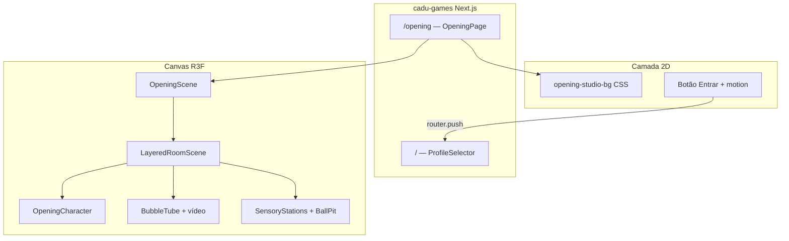

# Plano de migração — Sala sensorial 3D (cadu-prototype → cadu-games)

> **Status:** análise concluída — nenhum arquivo foi movido ainda.  
> **Data:** 2026-06-09  
> **Objetivo:** reaproveitar a sala sensorial 3D do `cadu-prototype` como abertura do `cadu-games` (`/opening` ou `/intro`).

---

## 1. Resumo executivo

A sala sensorial no prototype é uma cena React Three Fiber composta em **camadas**. O ponto de entrada do Canvas é `Scene.jsx`; o conteúdo visual da sala é `LayeredRoomScene.jsx`. O urso riggado é `CharacterController.jsx`, instanciado em `LayerCharacter.jsx`.

Para o `cadu-games` (Next.js 15, App Router), a abordagem recomendada é criar uma rota dedicada com um **subset enxuto** da cena (Tier B abaixo), reutilizando o padrão já existente em `components/life/vale/ValeWorldScene.tsx` (`'use client'` + `Canvas` + `dynamic` import). O prototype depende fortemente de **Zustand** (`useCADUStore`); o games ainda não usa Zustand — será preciso adicionar a dependência ou extrair um store mínimo local.

**Peso total dos assets essenciais:** ~408 MB em GLBs + **235 MB** no vídeo do tubo (`tubebubble.mp4`) ≈ **643 MB**. O diretório `public/models` do prototype tem ~2 GB (inclui assets de outros mundos não usados pela sala).

---

## 2. Componente principal da sala sensorial

### Hierarquia (do externo para o interno)

```
App.jsx (viewMode === '3d')
└── Scene.jsx                    ← Canvas R3F + luzes + câmera fixa + sombras
    ├── Lights.jsx
    ├── LayeredRoomScene.jsx     ← ★ COMPOSIÇÃO PRINCIPAL DA SALA
    │   ├── RoomAtmosphere.jsx
    │   │   ├── SensoryRoomShell.jsx   (ciclorama / paredes curvas)
    │   │   ├── LayerSky.jsx
    │   │   └── HorizonGroundMist.jsx
    │   ├── LayerAmbient.jsx           (nuvens + partículas)
    │   ├── LayerEnvironment.jsx
    │   │   └── StylizedRoom.jsx       (tapete circular + anéis LED)
    │   ├── LayerSensoryObjects.jsx
    │   │   ├── BubbleTube.jsx
    │   │   │   ├── BubbleTubeGlb.jsx
    │   │   │   └── BubbleTubeVideoScreen.jsx  (vídeo 360° no interior)
    │   │   └── SensoryStation × 3 (barras, balanço, painel emocional placeholder)
    │   ├── LayerCharacter.jsx
    │   │   └── CharacterController.jsx
    │   ├── ForegroundBallPit.jsx      (piscina em primeiro plano)
    │   ├── LayerMagic.jsx             (partículas / poeira)
    │   └── LayerHotspots.jsx          (UI 3D clicável — estações)
    ├── NavMeshFloor.jsx               (clique no chão → urso anda)
    ├── FixedRoomCamera.jsx
    └── ContactShadows
```

### Identificação clara

| Papel | Arquivo | Notas |
|-------|---------|-------|
| **Entry point Canvas** | `cadu-prototype/src/components/Scene/Scene.jsx` | Configura renderer, fog, tone mapping, sombras |
| **Composição da sala** | `cadu-prototype/src/components/Scene/LayeredRoomScene.jsx` | Orquestra todas as camadas |
| **Backdrop arquitetônico** | `cadu-prototype/src/components/Scene/SensoryRoomShell.jsx` | Ciclorama shader + paredes laterais |
| **Palco / chão** | `cadu-prototype/src/components/Scene/StylizedRoom.jsx` | Tapete procedural (sem GLB) |
| **Coluna de bolhas** | `cadu-prototype/src/components/Scene/BubbleTube.jsx` | GLB + vídeo + caustics |

O CSS de fundo (`ROOM_STUDIO_GRADIENT_CSS` em `constants/roomBackdrop.js`) é aplicado **fora** do Canvas, em `App.jsx`, via classe `.cadu-room-studio-bg`. Para fidelidade visual, o games precisará replicar esse degradê no wrapper da página.

---

## 3. Componente do urso riggado andando

### Arquivo principal

**`cadu-prototype/src/components/Character/CharacterController.jsx`**

- Carrega o GLB via `useGLTF` + `useAnimations` (`@react-three/drei`)
- URL definida em `constants/characterModel.js`:
  ```
  /models/Meshy_AI_Rosy_Cuddle_Bear_biped_v2/
    Meshy_AI_Rosy_Cuddle_Bear_biped_Meshy_AI_Meshy_Merged_Animations.glb
  ```
- Aplica material cel-shaded (`utils/celShade.js`)
- Instanciado em `layers/LayerCharacter.jsx` com spawn em `CADU_START_POSITION` / `CADU_START_ROTATION`

### Locomoção e animação

| Hook / util | Função |
|-------------|--------|
| `hooks/useCharacterMovement.js` | Walk/run até `targetPosition` no store; usa `clampToNavMesh` |
| `hooks/useCharacterAnimations.js` | Mapeia estado → clip (idle / walk / run) via registry |
| `hooks/useKeyboardMovement.js` | Setas / WASD (opcional para intro) |
| `hooks/useActivityBarsInteraction.js` | Interação com barras — **não necessário na abertura** |
| `utils/animationRegistry.js` | Resolve nomes canônicos dos clips no GLB |
| `utils/animationCommandPlay.js` | Playback com crossfade |
| `constants/animationCommandMap.js` | Comandos idle/walk/run |
| `constants/glbClipRenameMap.js` | Normalização de nomes de clips Meshy |

### Dependências de UI acopladas ao personagem (removíveis na intro)

- `CharacterMoodPicker` (clique no urso)
- `ActivityBarsReward` (mini-jogo das barras)
- Painel de debug de animações

### Versão mínima para abertura

Para uma intro cinematográfica, basta um `CharacterController` simplificado ou um fork `OpeningBear.tsx` que:

1. Carrega o mesmo GLB
2. Reproduz `idle` em loop (ou sequência idle → walk automática)
3. **Não** depende de `useCADUStore` para clique no chão

Para manter interatividade (clique para andar), é necessário portar também `NavMeshFloor`, `useCharacterMovement` e fatias do store (`targetPosition`, `characterState`, `bubbleTubeCollider`).

---

## 4. GLBs e vídeos necessários

### 4.1 GLBs — obrigatórios para sala completa

| Arquivo | Caminho no prototype | Tamanho | Usado por |
|---------|----------------------|---------|-----------|
| Urso riggado | `public/models/Meshy_AI_Rosy_Cuddle_Bear_biped_v2/Meshy_AI_Rosy_Cuddle_Bear_biped_Meshy_AI_Meshy_Merged_Animations.glb` | 16 MB | `CharacterController` |
| Tubo de bolhas | `public/models/tubo de bolhas.glb` | 51 MB | `BubbleTubeGlb` |
| Piscina de bolinhas | `public/models/bolinhaspiscina.glb` | 46 MB | `SensoryStation` + `ForegroundBallPit` |
| Barras de atividades | `public/models/barras.glb` | 39 MB | `SensoryStation` |
| Balanço / casulo | `public/models/balanco.glb` | 15 MB | `SensoryStation` |

**Subtotal GLBs:** ~167 MB (urso + objetos) — na prática ~408 MB somando duplicata da piscina no foreground (mesmo arquivo, uma cópia).

> **Atenção:** o arquivo `tubo de bolhas.glb` tem **espaço no nome**. No Next.js, servir de `public/opening/tubo-de-bolhas.glb` (renomear) evita problemas de URL encoding.

### 4.2 Vídeos

| Arquivo | Tamanho | Usado por | Necessário? |
|---------|---------|-----------|-------------|
| `tubebubble.mp4` | **235 MB** | `BubbleTubeVideoScreen.jsx` — textura cilíndrica 360° dentro do tubo | **Sim**, para fidelidade da coluna |
| `video_cadu2.mp4` | 3.5 MB | `CaduIntroVideoModal.jsx` — modal na landing 2D, **não** na cena 3D | Opcional (camada 2D sobre a intro) |
| `caduvideo.mp4` | 2.4 MB | **Não referenciado no código** | Não migrar |

### 4.3 GLBs / assets NÃO usados pela sala sensorial

Presentes em `public/models/` mas fora do escopo desta migração:

- `cadu.glb` (legado, constante `CADU_MODEL_URL_LEGACY` — arquivo ausente no disco)
- Pasta `GLB files/` (documentação / outros mundos CADU Life)
- SVGs, clouds, fruit stall, xylophone, etc.
- `interactive-map/water.mp4` (mapa 2.5D, não a sala)

### 4.4 Geometria procedural (sem arquivo)

Estes componentes **não** precisam de assets externos:

- `SensoryRoomShell` — cilindro + shader
- `StylizedRoom` — tapete CanvasTexture
- `LayerSky`, `LayerAmbient`, `LayerMagic`, `HorizonGroundMist`
- `Lights`, `ContactShadows`, caustics do `BubbleTube`

---

## 5. Dependências de código a portar

### 5.1 Stack — compatibilidade

| Pacote | cadu-prototype | cadu-games | Ação |
|--------|----------------|------------|------|
| `three` | ^0.184.0 | ^0.184.0 | OK |
| `@react-three/fiber` | ^9.6.1 | ^9.6.1 | OK |
| `@react-three/drei` | ^10.7.7 | ^10.7.7 | OK |
| `zustand` | ^5.0.13 | **ausente** | Adicionar ou substituir por React context local |
| Bundler | Vite (`import.meta.env.DEV`) | Next.js 15 | Ajustar cache-bust do GLB |

### 5.2 Árvore de arquivos — sala completa interativa (Tier B)

```
components/opening/          (novo no cadu-games)
├── OpeningScene.tsx         ← fork de Scene.jsx
├── LayeredRoomScene.tsx
├── RoomAtmosphere.tsx
├── SensoryRoomShell.tsx
├── StylizedRoom.tsx
├── BubbleTube.tsx
├── BubbleTubeGlb.tsx
├── BubbleTubeVideoScreen.tsx
├── sensory/
│   ├── SensoryStation.tsx
│   └── ForegroundBallPit.tsx
├── layers/
│   ├── LayerAmbient.tsx
│   ├── LayerEnvironment.tsx
│   ├── LayerSensoryObjects.tsx
│   ├── LayerCharacter.tsx
│   ├── LayerMagic.tsx
│   └── LayerSky.tsx
├── Lights.tsx
├── FixedRoomCamera.tsx
├── NavMeshFloor.tsx
├── TherapeuticGlb.tsx
├── AliveMotion.tsx
├── HorizonGroundMist.tsx
├── DustParticles.tsx
├── ModelErrorBoundary.tsx
└── character/
    └── OpeningCharacter.tsx   ← fork simplificado de CharacterController

lib/opening/                 (constants + utils portados)
├── roomBackdrop.ts
├── sceneLayout.ts
├── sceneComposition.ts
├── sensoryObjects.ts
├── sensoryRoomShell.ts
├── bubbleTube.ts
├── characterModel.ts
├── animations.ts
├── palette.ts
├── sceneLayers.ts
├── animationRegistry.ts
├── animationCommandMap.ts
├── glbClipRenameMap.ts
├── celShade.ts
├── bubbleTubeMetrics.ts
├── navMesh.ts
├── animationActions.ts
└── animationCommandPlay.ts

hooks/opening/
├── useCharacterMovement.ts
├── useCharacterAnimations.ts
└── useSceneAnimating.ts

store/
└── useOpeningStore.ts       ← subset mínimo do useCADUStore

public/opening/
├── bear.glb                 (renomear do Meshy)
├── tubo-de-bolhas.glb
├── bolinhaspiscina.glb
├── barras.glb
├── balanco.glb
└── tubebubble.mp4
```

### 5.3 O que **não** portar para a abertura

Ferramentas de desenvolvimento e gameplay do prototype:

- `ScenePickTool`, `SceneEditorGizmo`, `ActivityBarsConfigEditor`, `ActivityBarsDebugMarkers`
- `ScenePickOverlay`, `SceneEditorOverlay`, `ActivityBarsConfigOverlay`
- `CharacterAnimationPanel`, `CameraControlsBar`, `HUD`
- `LayerHotspots` + `SensoryHotspot` (a menos que a intro tenha CTAs por estação)
- `useActivityBarsInteraction`, `ActivityBarsInteraction`
- `EditableTransform` + `sceneEditorStorage` (ou manter só leitura dos defaults)
- `InteractiveMapScene`, `LandingScreen`, `TemplateParallaxScene`

### 5.4 Estado global — fatias mínimas do `useCADUStore`

Para walk + animação básica:

```ts
// useOpeningStore (proposta)
{
  characterState: 'idle' | 'walk' | 'run'
  targetPosition: [number, number, number] | null
  bubbleTubeCollider: number
  markedCamera: { position, target, fov }
  animationClips: string[]
  setWalkTarget(x, z)
  clearTarget()
  setCharacterState()
  resetToIdle()
}
```

---

## 6. Proposta de integração no cadu-games

### 6.1 Rota recomendada: `/opening`

| Opção | Prós | Contras |
|-------|------|---------|
| **`/opening`** (recomendado) | Não quebra `/` atual (`ProfileSelector`); fácil de testar isolado; pode ser primeira visita via redirect | Requer decisão de fluxo (redirect automático ou link) |
| `/intro` | Nome curto, semântica clara | Colide conceitualmente com `video_cadu2` modal |
| Substituir `/` | Impacto máximo na primeira impressão | Bloqueia seleção de perfil até intro terminar; pior para dev |

**Fluxo sugerido:**

```
1ª visita (localStorage flag `cadu-opening-seen`)
  / → redirect /opening → animação 8–12s → botão "Entrar" → / (ProfileSelector)

Visitas seguintes
  / → ProfileSelector direto
```

Alternativa mais simples (MVP): `/opening` acessível manualmente; link "Conhecer o CADU" na home.

### 6.2 Estrutura de página Next.js

```
app/opening/
├── page.tsx              ← server component, metadata
├── OpeningPage.tsx       ← 'use client', layout fullscreen
└── opening.css           ← .opening-studio-bg (gradiente do prototype)
```

`page.tsx`:

```tsx
import dynamic from 'next/dynamic'

const OpeningPage = dynamic(() => import('./OpeningPage'), {
  ssr: false,
  loading: () => <OpeningSplash />,
})

export default function Page() {
  return <OpeningPage />
}
```

Padrão idêntico ao necessário para R3F no Next (já usado implicitamente em `ValeWorldScene` com `'use client'`).

### 6.3 Camadas de experiência (tiers)

#### Tier A — Intro cinematográfica (~40% do esforço)

- Canvas + `RoomAtmosphere` + `StylizedRoom` + `Lights` + `FixedRoomCamera`
- Urso em idle (GLB único, 16 MB)
- Overlay 2D: logo, copy, botão "Entrar"
- **Sem** objetos sensoriais, **sem** vídeo do tubo
- Assets: **16 MB**

#### Tier B — Sala sensorial visual completa (~75% do esforço) ★ recomendado

- Tudo do Tier A + `LayerSensoryObjects` + `ForegroundBallPit` + `LayerAmbient` + `LayerMagic`
- Coluna com GLB + `tubebubble.mp4`
- Urso com idle; walk opcional (clique no chão)
- **Sem** hotspots, barras interativas, mood picker
- Assets: **~643 MB**

#### Tier C — Paridade com prototype (~100%)

- Tier B + hotspots + mood + activity bars + editor debug
- Portar `useCADUStore` quase integral
- Só faz sentido se a abertura for uma "sala jogável", não uma intro

### 6.4 UI da abertura (camada 2D)

Elementos sugeridos sobre o Canvas:

1. Degradê vignette (já existe `.cadu-app__vignette--studio` no prototype CSS)
2. Título + subtítulo com `framer-motion` (já no games)
3. CTA "Escolher perfil" → `router.push('/')`
4. *(Opcional)* `video_cadu2.mp4` em modal antes ou depois da cena 3D

Reutilizar tokens de `lib/theme.ts` / `lib/theme.css` para consistência com o restante do app.

### 6.5 Performance e entrega de assets

| Risco | Mitigação |
|-------|-----------|
| `tubebubble.mp4` (235 MB) | Comprimir/re-encode (H.265/WebM, resolução menor); lazy load após primeiro frame; Tier A sem vídeo |
| GLBs grandes (39–51 MB cada) | `useGLTF.preload()` na rota anterior; Draco compression; carregar piscina/barras/balanço em `Suspense` separados |
| LCP na abertura | Splash estático com gradiente enquanto Canvas monta (como `ValeWorldScene` faz com Suspense) |
| Mobile | `dpr={[1, 1.5]}` já no prototype; respeitar `prefers-reduced-motion` (já em `BubbleTubeVideoScreen`) |

### 6.6 Conversão Vite → Next.js (checklist técnico)

- [ ] Trocar `import.meta.env.DEV` por `process.env.NODE_ENV === 'development'` no cache-bust do GLB
- [ ] Renomear `.jsx` → `.tsx` com tipos mínimos (`RefObject<Group>`, etc.)
- [ ] Mover paths `/models/...` → `/opening/...` em constants
- [ ] Adicionar `'use client'` em todo componente com hooks R3F
- [ ] Portar CSS: extrair `.cadu-room-studio-bg` e vignette para `opening.css` ou Tailwind arbitrary values
- [ ] `next.config.ts`: considerar `headers` de cache longo para GLB/mp4 em `public/opening/`
- [ ] Adicionar `zustand` ao `package.json` **ou** `OpeningContext` com `useReducer`

---

## 7. Plano de execução em fases (quando autorizado)

### Fase 0 — Preparação (sem mover código)

- [x] Este documento
- [ ] Validar com design se Tier A ou B
- [ ] Decidir compressão do `tubebubble.mp4`
- [ ] Confirmar fluxo `/` vs `/opening`

### Fase 1 — Assets

1. Criar `public/opening/` no cadu-games
2. Copiar (não mover) os 5 GLBs + `tubebubble.mp4`
3. Renomear `tubo de bolhas.glb` → `tubo-de-bolhas.glb`
4. Atualizar constantes com novos paths

### Fase 2 — Núcleo 3D

1. Portar constants + utils (`celShade`, `bubbleTubeMetrics`, `navMesh`, animation utils)
2. Portar componentes de atmosfera + palco + luzes
3. Criar `OpeningScene.tsx` (Canvas enxuto, sem debug)
4. Validar visual em `npm run dev` na rota `/opening`

### Fase 3 — Personagem

1. Portar `CharacterController` → `OpeningCharacter.tsx` (sem mood/barras)
2. Portar hooks de movimento + animação
3. Criar `useOpeningStore`
4. Testar idle + walk por clique

### Fase 4 — Objetos sensoriais

1. Portar `BubbleTube` + `TherapeuticGlb` + `SensoryStation` + `ForegroundBallPit`
2. Verificar vídeo no tubo
3. Ajustar câmera fixa (`FIXED_CAMERA` em `sceneComposition`)

### Fase 5 — Integração UX

1. Wrapper 2D com CTA e animação de entrada (`framer-motion`)
2. Redirect opcional na home (`localStorage`)
3. Testes mobile + reduced motion
4. Documentar no README

### Fase 6 — Limpeza

1. Remover código morto do fork
2. ESLint / types
3. Medir bundle e tempo de carregamento

---

## 8. Mapa mental da arquitetura alvo



---

## 9. Referências rápidas no repositório

| Item | Caminho prototype |
|------|-------------------|
| Canvas entry | `src/components/Scene/Scene.jsx` |
| Composição sala | `src/components/Scene/LayeredRoomScene.jsx` |
| Shell ciclorama | `src/components/Scene/SensoryRoomShell.jsx` |
| Urso | `src/components/Character/CharacterController.jsx` |
| Spawn urso | `src/components/Scene/layers/LayerCharacter.jsx` |
| URL do urso | `src/constants/characterModel.js` |
| Objetos + GLBs | `src/constants/sensoryObjects.js` |
| Layout cena | `src/constants/sceneComposition.js` |
| Vídeo tubo | `src/constants/bubbleTube.js` |
| Gradiente CSS | `src/constants/roomBackdrop.js` |
| App shell 3D | `src/App.jsx` (linhas 81–91) |

| Item | Caminho cadu-games (referência existente) |
|------|-------------------------------------------|
| Padrão R3F Next | `components/life/vale/ValeWorldScene.tsx` |
| Home atual | `app/page.tsx` |
| Dependências 3D | `package.json` |

---

## 10. Decisões em aberto

1. **Tier A vs B** — aceitar ~643 MB na primeira visita ou intro mais leve sem tubo/objetos?
2. **Interatividade** — urso só em idle ou clique para andar na intro?
3. **Vídeo 2D** — incluir `video_cadu2.mp4` no fluxo da abertura?
4. **Rota final** — `/opening` ou `/intro`?
5. **Symlink vs cópia** — assets duplicados entre repos ou pasta compartilhada no monorepo?

---

*Documento gerado por análise estática do código — nenhum arquivo foi copiado ou alterado além deste plano.*
